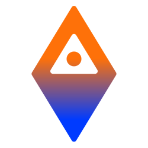

<p align="center">
  
  <h1 align="center">ADI Stack Helm Chart</h1>
  <p align="center">
    A joint effort by <a href="https://adifoundation.ai">ADI Foundation</a> and <a href="https://settlemint.com">SettleMint</a>
    <br/>
    Production-ready Kubernetes deployment for ADI Stack zkOS L2 External Nodes.
  </p>
</p>
<br/>
<p align="center">
<a href="https://github.com/SettleMint-Collaboration/adi-helm/actions?query=branch%3Amain"></a>
<a href="https://github.com/SettleMint-Collaboration/adi-helm" rel="nofollow"></a>
<a href="https://github.com/SettleMint-Collaboration/adi-helm" rel="nofollow"></a>
<a href="https://github.com/SettleMint-Collaboration/adi-helm" rel="nofollow"></a>
<a href="https://github.com/SettleMint-Collaboration/adi-helm" rel="nofollow"></a>
</p>

<div align="center">
  <a href="https://github.com/ADI-Foundation-Labs/ADI-Network-Documentation">Documentation</a>
  <span>&nbsp;&nbsp;•&nbsp;&nbsp;</span>
  <a href="https://github.com/SettleMint-Collaboration/adi-helm/issues">Issues</a>
  <span>&nbsp;&nbsp;•&nbsp;&nbsp;</span>
  <a href="https://adifoundation.ai">ADI Foundation</a>
  <span>&nbsp;&nbsp;•&nbsp;&nbsp;</span>
  <a href="https://settlemint.com">SettleMint</a>
  <br />
</div>

## Introduction

The ADI Stack Helm Chart provides a production-ready deployment solution for running ADI Stack zkOS L2 External Nodes on Kubernetes and OpenShift clusters. This chart is developed and maintained jointly by [ADI Foundation](https://adifoundation.ai) and [SettleMint](https://settlemint.com), combining ADI's blockchain expertise with SettleMint's enterprise deployment experience.

### Key Features

- **Multi-Platform Support** - Deploy on Kubernetes 1.24+ or OpenShift 4.12+
- **Multi-Cloud Ready** - Optimized configurations for AWS EKS, Google GKE, and Azure AKS
- **Integrated Ethereum Node** - Built-in Erigon node with Caplin consensus layer for L1 RPC
- **Performance Tiers** - Pre-configured resource profiles for development, testnet, and production
- **Flexible Ingress** - Contour HTTPProxy with timeout support for JSON-RPC workloads
- **Enterprise Security** - OpenShift restricted SCC compatible, Pod Security Standards compliant
- **Cloudflare Tunnel** - Built-in Cloudflared support for secure external access
- **Monitoring Ready** - Prometheus ServiceMonitor support out of the box

## Quick Start

### Prerequisites

- Kubernetes 1.24+ or OpenShift 4.12+
- Helm 3.x or 4.x
- kubectl configured for your cluster
- jq (for force cleanup operations)

### Installation

Clone the repository and use the provided scripts:

```bash
git clone https://github.com/SettleMint-Collaboration/adi-helm.git
cd adi-helm
```

#### Step 1: Install Support Infrastructure

Install Contour (ingress controller) and optionally cert-manager (TLS):

```bash
# AWS EKS
./install-support.sh -c aws

# AWS EKS with TLS
./install-support.sh -c aws -t -e admin@example.com

# Google GKE with TLS
./install-support.sh -c gke -t -e admin@example.com

# Azure AKS with TLS
./install-support.sh -c azure -t -e admin@example.com
```

#### Step 2: Install ADI Stack

Deploy testnet or mainnet:

```bash
# Testnet with Contour ingress
./install.sh testnet \
  -n adi-testnet \
  -c aws \
  -p low \
  -i contour \
  -s ingress.hostname=testnet.example.com

# Mainnet with Contour ingress and TLS
./install.sh mainnet \
  -n adi-mainnet \
  -c aws \
  -p high \
  -i contour \
  -t \
  -s ingress.hostname=mainnet.example.com

# Testnet with external L1 RPC (no Erigon)
./install.sh testnet \
  -n adi-testnet \
  -c aws \
  -i contour \
  -s erigon.enabled=false \
  -s l1Rpc.url=https://eth-sepolia.example.com \
  -s ingress.hostname=testnet.example.com
```

#### Step 3: Configure DNS

Point your domains to the LoadBalancer:

```bash
# Get LoadBalancer address
kubectl get svc -n gateway contour-envoy \
  -o jsonpath='{.status.loadBalancer.ingress[0].hostname}'
```

Create DNS records:

- `testnet.example.com -> <loadbalancer-address>`
- `mainnet.example.com -> <loadbalancer-address>`

### Uninstallation

```bash
# Uninstall adi-stack from a namespace
./uninstall.sh -n adi-testnet

# Force uninstall (handles stuck resources)
./uninstall.sh -n adi-testnet -f

# Uninstall all adi-stack deployments
./uninstall.sh -a -f

# Uninstall support infrastructure
./uninstall-support.sh -f
```

## Script Reference

### install-support.sh

Installs Contour and cert-manager in your cluster.

| Flag | Long Form   | Description                       |
| ---- | ----------- | --------------------------------- |
| `-c` | `--cloud`   | Cloud provider: aws, gke, azure   |
| `-t` | `--tls`     | Install cert-manager for TLS      |
| `-e` | `--email`   | Email for Let's Encrypt (with -t) |
| `-u` | `--upgrade` | Upgrade existing installations    |
| `-d` | `--dry-run` | Show what would be installed      |

### install.sh

Installs adi-stack with layered configuration.

| Flag | Long Form        | Description                         |
| ---- | ---------------- | ----------------------------------- |
|      | `testnet`        | Deploy with Sepolia testnet         |
|      | `mainnet`        | Deploy with Ethereum mainnet        |
| `-n` | `--namespace`    | Kubernetes namespace                |
| `-c` | `--cloud`        | Cloud provider: aws, gke, azure     |
| `-p` | `--performance`  | Performance tier: low, medium, high |
| `-i` | `--ingress`      | Ingress: contour, nginx, none       |
| `-t` | `--cert-manager` | Enable TLS with cert-manager        |
| `-o` | `--openshift`    | Use OpenShift-specific values       |
| `-s` | `--set`          | Set Helm values (repeatable)        |
| `-f` | `--values`       | Additional values file              |
| `-u` | `--upgrade`      | Upgrade existing release            |
| `-d` | `--dry-run`      | Template only, don't install        |

### uninstall.sh

Removes adi-stack deployments with stuck resource handling.

| Flag | Long Form     | Description                      |
| ---- | ------------- | -------------------------------- |
| `-n` | `--namespace` | Namespace to uninstall           |
| `-r` | `--release`   | Helm release name                |
| `-a` | `--all`       | Uninstall all adi-stack releases |
| `-f` | `--force`     | Force removal of stuck resources |
| `-d` | `--dry-run`   | Show what would be uninstalled   |

### uninstall-support.sh

Removes Contour and cert-manager with CRD cleanup.

| Flag | Long Form            | Description                    |
| ---- | -------------------- | ------------------------------ |
| `-f` | `--force`            | Force removal of stuck CRDs    |
| `-c` | `--contour-only`     | Only uninstall Contour         |
| `-m` | `--certmanager-only` | Only uninstall cert-manager    |
| `-d` | `--dry-run`          | Show what would be uninstalled |

## Configuration

### L1 RPC Options

#### Built-in Erigon Node (Recommended)

Erigon includes an integrated Caplin consensus layer:

```bash
./install.sh mainnet -n adi-mainnet -c aws -p high
```

#### External RPC Provider

```bash
./install.sh testnet -n adi-testnet -c aws \
  -s erigon.enabled=false \
  -s l1Rpc.url=https://eth-sepolia.example.com
```

### Performance Tiers

| Tier     | Use Case            | IOPS | Storage               |
| -------- | ------------------- | ---- | --------------------- |
| `low`    | Development/Testing | 3K   | Basic SSD             |
| `medium` | Testnet nodes       | 16K  | SSD with provisioning |
| `high`   | Production mainnet  | 64K+ | Premium/Hyperdisk     |

### OpenShift Deployment

```bash
./install.sh testnet -n adi-testnet -o
./install.sh mainnet -n adi-mainnet -o
```

## Values Files Reference

All values files are in `adi-stack/examples/`:

**Base configurations:**

| File                            | Description                     |
| ------------------------------- | ------------------------------- |
| `values-testnet.yaml`           | Kubernetes testnet (Sepolia)    |
| `values-production.yaml`        | Kubernetes mainnet (production) |
| `values-openshift-testnet.yaml` | OpenShift testnet               |
| `values-openshift-mainnet.yaml` | OpenShift mainnet               |

**Cloud provider layers:**

| File                      | Description                        |
| ------------------------- | ---------------------------------- |
| `values-cloud-aws.yaml`   | AWS EKS (gp3/io2 storage)          |
| `values-cloud-gke.yaml`   | Google GKE (premium-rwo/hyperdisk) |
| `values-cloud-azure.yaml` | Azure AKS (managed-csi-premium)    |

**Performance tiers:**

| File                             | Description                    |
| -------------------------------- | ------------------------------ |
| `values-performance-low.yaml`    | Development/testing (3K IOPS)  |
| `values-performance-medium.yaml` | Testnet nodes (16K IOPS)       |
| `values-performance-high.yaml`   | Production mainnet (64K+ IOPS) |

**Ingress and TLS:**

| File                          | Description                     |
| ----------------------------- | ------------------------------- |
| `values-ingress-contour.yaml` | Contour HTTPProxy configuration |
| `values-tls-certmanager.yaml` | TLS with cert-manager           |

**Support infrastructure (in `examples/support/`):**

| File                              | Description                 |
| --------------------------------- | --------------------------- |
| `contour-values-aws.yaml`         | Contour for AWS EKS         |
| `contour-values-gke.yaml`         | Contour for Google GKE      |
| `contour-values-azure.yaml`       | Contour for Azure AKS       |
| `cert-manager-clusterissuer.yaml` | Let's Encrypt ClusterIssuer |

## Monitoring

```bash
# View all pods
kubectl get pods -n adi-testnet

# Monitor Erigon sync progress
kubectl logs -n adi-testnet -l app.kubernetes.io/component=erigon -f

# Monitor External Node logs
kubectl logs -n adi-testnet -l app.kubernetes.io/component=external-node -f

# Access RPC endpoint locally
kubectl port-forward -n adi-testnet svc/adi-stack-adi-stack 3050:3050
```

## Troubleshooting

### Stuck Namespace Deletion

If a namespace is stuck in `Terminating` state:

```bash
./uninstall.sh -n <namespace> -f
```

### Stuck CRD Deletion

If CRDs are stuck after uninstalling support infrastructure:

```bash
./uninstall-support.sh -f
```

### Manual Finalizer Removal

For resources stuck with finalizers:

```bash
# Remove finalizers from a specific resource
kubectl patch <resource-type> <name> -n <namespace> \
  -p '{"metadata":{"finalizers":null}}' --type=merge

# Example: stuck challenge
kubectl patch challenge my-challenge -n adi-testnet \
  -p '{"metadata":{"finalizers":null}}' --type=merge
```

## Contributing

Contributions are welcome! Please read our contributing guidelines and submit pull requests to the [GitHub repository](https://github.com/SettleMint-Collaboration/adi-helm).

## About

### ADI Foundation

[ADI Foundation](https://adifoundation.ai) is building the next generation of blockchain infrastructure with zkOS, a zero-knowledge Layer 2 solution designed for scalability, security, and enterprise adoption.

### SettleMint

[SettleMint](https://settlemint.com) is the leading enterprise blockchain platform, providing tools and infrastructure for building, deploying, and managing blockchain applications at scale.

## License

This project is licensed under the MIT License - see the [LICENSE](adi-stack/LICENSE) file for details.
